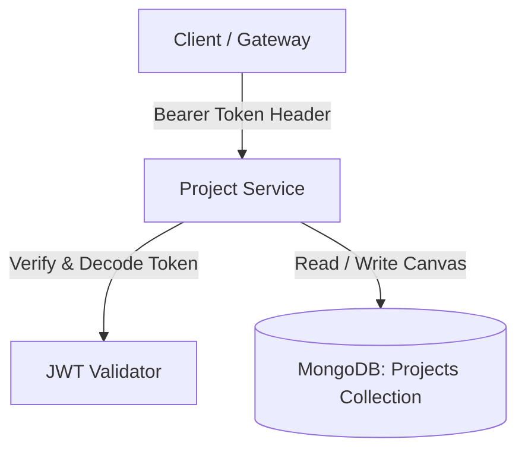

# Project Service (project-service)

The Project Service manages user-created architecture canvases. It persists diagram elements (nodes, edges, services), tracks configuration values (cloud provider, budget target region), supports incremental version snapshots, and provides a rollback mechanism to restore active configurations to older snapshots. Built on **FastAPI** and using **MongoDB** (via **Motor** driver) as its datastore, it validates all sessions by decoding JWT tokens.

---

## 1. Core Architecture & Features

The service routes are defined in [routes/projects.py](file:///c:/Users/Praveen/Desktop/New%20folder/project-service/routes/projects.py).



### Key Capabilities:
1. **JWT Verification**: Decodes access tokens sent in the `Authorization: Bearer <token>` header to extract the authorized identity (`sub`).
2. **Version Control**: When updating an existing project (using a project ID), the service creates an incremental snapshot of the current canvas state (`nodes`, `edges`, `services`, `cost_estimate`) and appends it to a `versions` array field (`v1.0.0`, `v2.0.0`, etc.).
3. **Rollback Engine**: The service can copy the snapshot content of a specific version from the history array and overwrite the current active canvas state, facilitating seamless rollbacks.

---

## 2. Configuration & Environment Variables

Settings are loaded at initialization inside [main.py](file:///c:/Users/Praveen/Desktop/New%20folder/project-service/main.py):

| Variable | Type | Default | Description |
|---|---|---|---|
| `MONGO_URI` | `str` | *Required* | Connection string to MongoDB (or Azure Cosmos DB API for MongoDB). |
| `DATABASE_NAME` | `str` | `archgen_db` | Target MongoDB database name. |
| `JWT_SECRET_KEY` | `str` | *Required* | Secret key shared with the Auth Service to verify JWT signatures. |
| `ALLOWED_ORIGINS` | `str` | `http://localhost:3000` | CORS allowed origins. |

---

## 3. Database Schema Layout

Projects are stored in the `projects` collection. The active state is stored at the root, and history is tracked under `versions`:

```json
{
  "_id": {"$oid": "65c82a176180a312456e7aa5"},
  "username": "johndoe",
  "name": "Production Kubernetes Stack",
  "cloud_provider": "azure",
  "cost_estimate": 450.0,
  "region": "eastus",
  "workload_type": "web",
  "nodes": [
    { "id": "aks-cluster", "type": "BackendNode", "data": { "label": "AKS Cluster" } }
  ],
  "edges": [],
  "services": [],
  "versions": [
    {
      "version_id": "v1.0.0",
      "timestamp": "2026-06-24T12:00:00Z",
      "nodes": [...],
      "edges": [...],
      "services": [...],
      "cost_estimate": 450.0
    }
  ]
}
```

---

## 4. API Endpoints Reference

All routes require a valid `Authorization: Bearer <access_token>` header.

### Health checks

#### `GET /healthz`
- **Description**: Returns operational health.
- **Response (200 OK)**: `{"status": "healthy"}`

#### `GET /ready` or `GET /readyz`
- **Description**: Returns readiness status.
- **Response (200 OK)**: `{"status": "ready"}`

### Project Operations

#### `POST /projects/`
- **Description**: Saves a new project or updates an existing one (appending a new version snapshot).
- **Request Body (`ProjectSaveInput`)**:
  ```json
  {
    "id": "65c82a176180a312456e7aa5",
    "name": "Production Stack",
    "nodes": [
      {
        "id": "aks-cluster",
        "type": "BackendNode",
        "position": { "x": 100, "y": 150 },
        "data": { "label": "AKS Cluster", "provider": "azure" }
      }
    ],
    "edges": [],
    "services": [],
    "cloud_provider": "azure",
    "cost_estimate": 450.0,
    "region": "eastus",
    "workload_type": "web",
    "availability_target": "99.9%",
    "rto": "4 hours",
    "rpo": "1 hour"
  }
  ```
  - `id`: String (Optional). If omitted, a new project document is created. If provided, the existing document is updated and a new version snapshot is generated.
- **Responses**:
  - **200 OK (New Project)**:
    ```json
    {
      "status": "success",
      "id": "65c82a176180a312456e7aa5",
      "message": "Project saved successfully."
    }
    ```
  - **200 OK (Update Project)**:
    ```json
    {
      "status": "success",
      "id": "65c82a176180a312456e7aa5",
      "message": "Project updated and snapshot created successfully."
    }
    ```
  - **401 Unauthorized**: Invalid or missing JWT token.
  - **404 Not Found**: Project to update not found or belongs to another user.

#### `GET /projects/`
- **Description**: Returns a list of all project documents owned by the authenticated user.
- **Responses**:
  - **200 OK**:
    ```json
    [
      {
        "id": "65c82a176180a312456e7aa5",
        "username": "johndoe",
        "name": "Production Stack",
        "cloud_provider": "azure",
        "cost_estimate": 450.0,
        ...
      }
    ]
    ```

#### `GET /projects/{project_id}`
- **Description**: Retrieves detailed configuration data of a single project.
- **Responses**:
  - **200 OK**: Returns project document.
  - **400 Bad Request**: Malformed project ID.
  - **404 Not Found**: Project not found.

#### `DELETE /projects/{project_id}`
- **Description**: Deletes a specific project from the database.
- **Responses**:
  - **200 OK**:
    ```json
    {
      "status": "success",
      "message": "Project deleted successfully."
    }
    ```
  - **404 Not Found**: Project not found or unauthorized.

### Version Management

#### `GET /projects/{project_id}/versions`
- **Description**: Retrieves the version snapshot history array for a project.
- **Responses**:
  - **200 OK**:
    ```json
    [
      {
        "version_id": "v1.0.0",
        "timestamp": "2026-06-24T12:00:00Z",
        "nodes": [...],
        "edges": [...],
        "services": [...],
        "cost_estimate": 450.0
      }
    ]
    ```

#### `POST /projects/{project_id}/versions/{version_id}/rollback`
- **Description**: Reverts the active canvas state (`nodes`, `edges`, `services`, `cost_estimate`) to the snapshots stored in the specified version.
- **Responses**:
  - **200 OK**:
    ```json
    {
      "status": "success",
      "message": "Successfully rolled back project to version v1.0.0."
    }
    ```
  - **404 Not Found**: Project or version ID not found.
  - **400 Bad Request**: Rollback operation failed.

---

## 5. OpenAPI & Interactive API Documentation

Interactive endpoint documentations are hosted directly on the service container:
- **Swagger UI**: Access at `http://localhost:8002/docs` in local dev environments.
- **ReDoc**: Access at `http://localhost:8002/redoc` in local dev environments.
